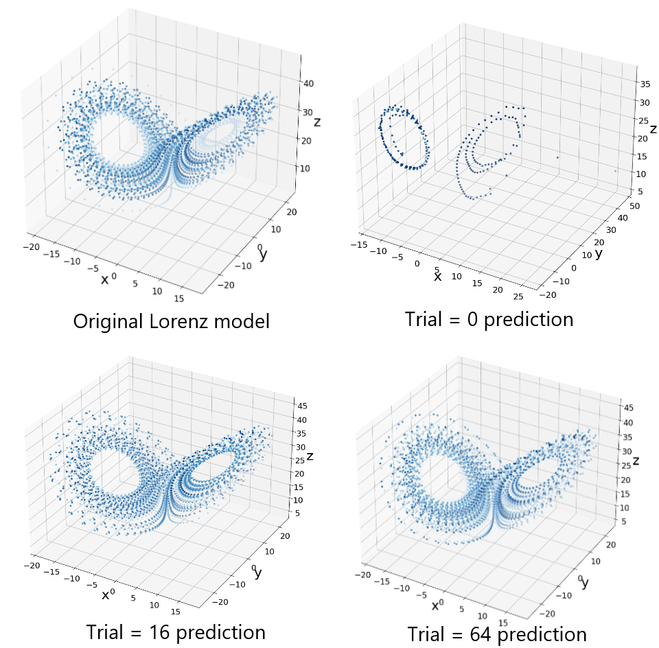

# Hyperparameter tuning of reservoir computers for attractor reconstruction（アトラクタ再構成のためのリザバーコンピューティングのhyperparameter tuning）

提案手法によって、アトラクタ再構成に達成していく様子

## Overview
卒業研究で行ったものです。

詳細はAbstract.pdf,卒業研究発表.pdfをご覧ください。

\png に予測結果やTuningの様子を載せています。

コードは非公開にしています🙇後々公開予定です。

## Author
[OEC-ket-bra](https://github.com/OEC-ket-bra)
